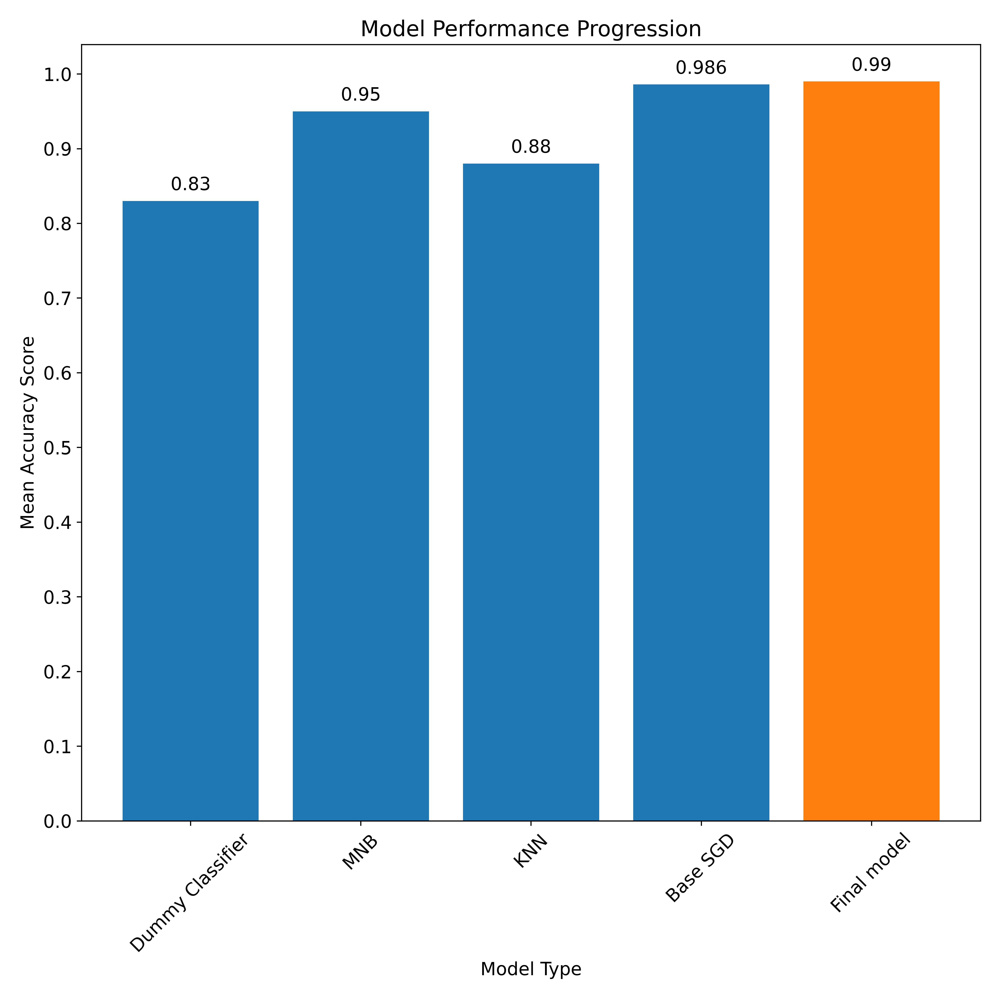

# Capstone-Political-data
Capstone Project for Flatiron

The data i am using is too large to be stored on github so to access the data download the data from this link: https://www.propublica.org/datastore/dataset/political-advertisements-from-facebook
# Tweet Sentiment Classifier for BaceFook
Authors: Tom Chapman & John Sheehan

## Business Problem
We (Tall Guy Outreach, LLC) are customer satisfaction consultants retained by BaceFook to gauge the community's reception to new functionality they are adding to their app. While BaceFook has great relationships with their largest enterprise customers, their app is used by individuals across the world. They need a reliable way to understand how individuals and small companies are responding to the new functionality without directly contacting each one.

Our understanding is that the development team feels their new features could be controversial. While the features are aimed at making the app more appealing to enterprise customers, there was some concern during the development process that additional options might overwhelm existing users. The company closely monitors new installs of their app, so the impact of new features on new users is something they feel they have a good handle on. As a result, we will limit our review to community response as a whole.

Currently, BaceFook pays contract employees to review their twitter mentions, record the tweets and label them based on the sentiment expressed within. This is a significant source of cost and inefficiency, since it requires a large team to keep up with the volume of mentions that follow a new version release.

We will use natural language processing on a tweet dataset in order to train our model to recognize emotion expressed in the tweets. Once BaceFook's new functionality is released, we can feed new tweet information that mentions the app to our model and help the company understand how individuals are receiving the new functionality. With a strong enough classifier, the company should be able to reduce or eliminate its reliance on contract labor.

## Data Understanding
Our dataset includes 9,092 tweets about multiple brands and products. The tweets were labeled as positive, negative, neutral or not sure by contributors based on the sentiment that the user expressed about the product or products being discussed in the tweet. We elected to drop the 156 "not sure" tweets from our dataset since they accounted for less than 2% of the overall population. Most of the products being discussed are related to mobile devices and applications for those mobile devices, making the data well-suited for training a model on how users express sentiment for these types of products.

The data contains a significant class imbalance, with only 4.5% (411 tweets) classified as negative and only 33% (2,978 tweets) classified as positive. The remaining 62.5% (5,388 tweets) were neutral, which will require us to address class imbalance before running our models. In addition, the dataset is relatively small for a complex problem like sentiment analysis and may be unduly influenced by very active tweeters.

Natural language processing requires a significant level of preprocessing prior to modeling, due to the variety of features in a dataset. These efforts are visible in the final notebook, and included the following steps:
- Removing Twitter handles & hyperlinks
- Removing punctuation
- Tokenizing and Lemmatizing the words in each tweet
- Removing stopwords (both common English words and a custom set that is unique to our dataset)

After preprocessing was complete, we visualized the most common words in each sentiment class as follows:

## Modeling 
Our modeling efforts involved an iterative process through different classifiers to find the one that performed best with default hyperparameters. We evaluated our model performance using accuracy scoring because the cost of an incorrect prediction is relatively low, and we are interested in seeing how well a model predicts each of the individual classes. We then utilized a grid search to tune the hyperparameters of our best performing model in an attempt to further improve performance. The models are presented in order within the [completed notebook](bacefook_notebook.ipynb) from worst to best performing to demonstrate our iterative process. For the purposes of this summary, we will focus on the final random forest classifier model.

The following graph shows the accuracy score of each successive model, and highlights the superior performance of the random forest classifier.

## Results & Model Evaluation
With an accuracy score on the test data of 67%, our final model is performing better than the baseline on unseen data. There is a great deal of room for improvement however, as it struggles heavily with correctly identifying negative sentiment. The model only identified 21% of negative tweets correctly in our test data, and only 46% of positive tweets in the test data. Its superior accuracy score is due largely to its success in accurately classifying neutral tweets as neutral. With more than 60% of the dataset comprised of neutral tweets, the success in predicting that class outweighs its poor performance with tweets that express emotion.

Given the class imbalance present in the dataset, it is likely that the model doesn't have enough examples of negative sentiment to perform well. This could be improved with a larger (or at minimum, more balanced) dataset. In order to be useful for classifying new tweets, the model would need to significantly reduce or ideally eliminate the need for a human to manually check its work. Our model accomplishes that with a 67% accuracy rate, but still leaves quite a bit of room for error and therefore creates a requirement for manual follow-up. Further tuning of the model's hyperparameters are unlikely to produce significant improvement, meaning that more data (and specifically more negative data) is needed to improve the model's results.

If no further data can be reasonably obtained for training, a practical use of the model could be to separate future tweets into groups of "neutral" and "needing review". The "needing review" class could then be labeled by a human or fed to a binary classifier that might have success identifying them as positive or negative.

## Conclusion & Limitations

My findings while creating this model was that my model works extremely well at classifying political party between the two major parties republican and democrat. with an accuracy score of predicting the party of roughly 99% my model will be able to distinguish the vast majority of ads as being democrat or republican.

Democrats often used common words such as 'people', 'movement', and 'grassroots' which the model picked up on showing that at the time these ads were run the agenda of the democratic party was to unite people into a movement to be strong together.

republicans often would use words such as 'fight', 'take', 'want' which i would classify as strong action words, the focus of the republican party was to fight against the typical established politicians and democrats.

Both parties were trying to use strong key words to convince their followers to get together for a cause but the wording and targets of their messaging were completely different which my model was able to pick up on showing not only the party affiliation but also the agenda behind each party when looking at common words used in their ads.

My model will be extremely important for all in the political sphere, voters will be able to see what party is pushing what agenda for local elections, such as "vote yes on ..." ads are not as apparent who is pushing for them unless a prominent figure is endorsing the ad. Political scientist will be able to see the widespread agenda of both political parties, such as if the messaging is very similar from one politician to the next within a party if there is things going on behind the scenes telling everyone to say similar messaging. And finally politicians will be able use this information to figure out what the opposition is saying and how they're conveying their points to their constituants.

Although the model looks really good there are some major limitations to the model itself:

* __Agendas change overtime__ the model picking up the messaging and classifying ads extremely accurately is only relevant for that point in time, the messaging and words used in the model might become outdated so i will have to update the data used to check how the common words change with time. i can get more updated from ProPublica when it becomes available in a combined dataset instead of their daily uploads of ads for the day.

* __Model only Trained on facebook ads__ 
i do not know how the model will perform on political statements from places such as twitter, ads from other websites, and other avenues of political speech.

### Next Steps
* __Gather more up to date data__ 
The people at ProPublica send out data everyday on their ad collection but this data is not formatted in a way i can work with just yet, either create a system to automatically collect their data and compile it or wait for a new large data dump like the first dataset that i worked with to come out and compare a new model with that data to this model.

* __Add more politcal parties and neutral data__
Try and find sources within the data that are from political parties not associated with democrats or republicans and see if my model can classify that data as well as data from democrats and republicans.

* __Explore other politcal comments__
Explore how feeding in politcal statements from outside of facebook do with my model, such as from places like twitter, reddit, politicians websites and speeches. find out if my model will be able to accurately predict these statements and if not feed the model some of these statements so it can classify party affiliation better.

## For More Information

See the full analysis in the [Jupyter Notebook](Capstone_final.ipynb) or review [this presentation](final_bacefook_presentation.pdf).

For additional info, contact me:

- John:  johnjsheehan8@gmail.com  
 
## Repository Contents
- images
- workingNB
- .gitignore
- Capstone_final.ipynb
- Presentation.pdf
- README.md
