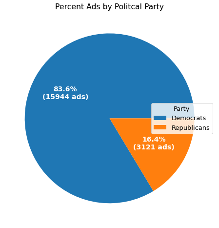
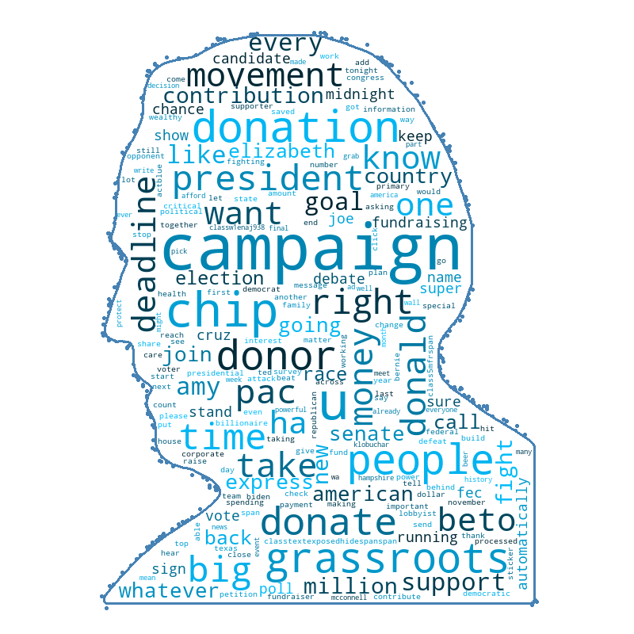
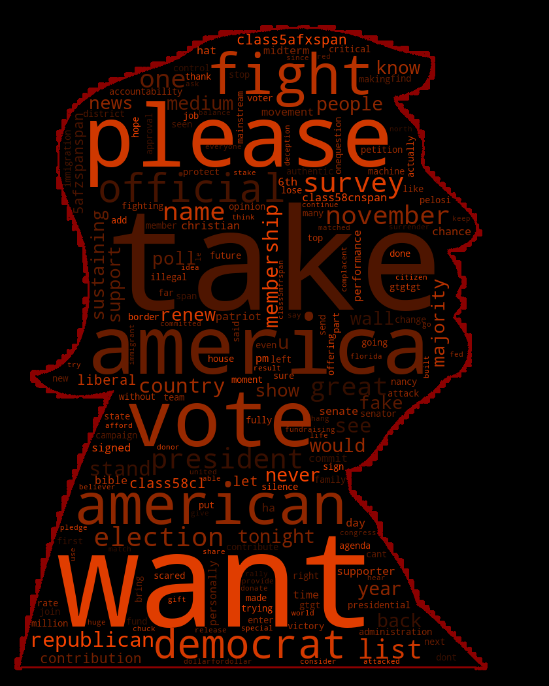

# Political Party Classifier by Facebook ads
By: John Sheehan

The first dataset that i worked with is too large to be stored on github so if you want to access the data use this link: https://www.propublica.org/datastore/dataset/political-advertisements-from-facebook

the second dataset is also fairly large and was a csv file collected from this github repository: https://github.com/unitedstates/congress-legislators
(The legislators-current csv)
## Business Problem
Hi my name is John Sheehan and i am a data scientist working to help experts in the political science field or politicans themselves gauge the messages and main interests other politcians are pushing for during election cycles. By taking any ads and figuring out what party affiliation the ads are associated with as well as the common words being pushed by these ads political scientiest can figure out whether politicians of the same party are pushing similar types of messaging across each political party. Another aspect of the model that im building is that voters will be able to determine what party is associated with ads that push for agendas on polls. Politicians can use this data to pinpoint common talking points their opposition tends to use to come up with counter arguments during debates or their own messaging

Currently politicians all have agendas during the election cycle and by figuring out each agenda it'll be really easy for oppositions to point out flaws in their messaging or voters to become more informed on their agenda, if a lot of politicians are saying the same message it can be proven that they're not speaking from what they want done but what the party wants done which can expose a lot of politicians that are just in it for positions of power

By correctly classifying ads by the words that they use within those ads im hoping to provide people with a better understanding of both who is running what ad but the contents of what each party/politician is pushing.

For this project im hoping to explain political ads to a deeper extent by creating a model that can predict Democrat and Republican ads and then look even deeper at what these ads are portraying.

## Data Understanding
The data i am going to be using is a dataset from ProPublica that contains 222186 different ads that they were able to collect from the years 2017-2022, the people at ProPublica collect data on ads run on facebook daily but only combine all of their data into a usable dataset every few years, so given that i have taken the most up to date selection of data i could get. The data contains 24 different categories of different metrics for each ad with some missing data. I am going to look through each category and select what is best for the model that i am building and remove nulls and columns that i will not be using.

By using this data i can narrow down my scope to only politicians ads so that i will be using only extremely polarizing ads to hopefully be able to pick up on ads that are from the democrat or republican party. One flaw with this dataset is that because i am only using data from the years 2017-2020 the model might be scewed toward predicting ads from those years, since agendas can change overtime the common words used during this period might be different from current or future ads.

After checking the base data i wanted to look at, i realized that i needed to import a second dataset of a list of politicians so that i can classify the names of the people who ran ads within the first dataset as either democrat or republican.

This dataset is a collection of all current members of congress, its not perfect since some of these ads are from memebers of congress in the past but i will manually go through and add a few additions to this list to include some important figures that do not show up in this dataset such as donald trump and joe biden.

With these two datasets i will create a model that will be able to accurately predict party affilliation from ads to a considerable amount.

## Data cleanup and Final Dataset
I used Natural Language Processing to clean up the ad messages as well as the names of those who ran the ads. Afterwards i created a new dataframe which only selected ads run by those who were listed on the second dataset and classified each ad into being from the republican or democratic party. This left me with a dataframe of 19065 political ads that were run by politicians. The vast majority of the ads run were from the democratic party as you can see from the pie chart below

## Visualizations
Now that i have gotten my final datafram situated i wanted to look at the different messaging being portrayed by each party so i made a wordclouds in the shape of two prominent figures of each party, Donald Trump and Joe Biden, showing common words used in the ad messaging pushed by each party.

## Modeling 
My modeling efforts involved an iterative process through different classifiers to find the one that performed best with default hyperparameters. I evaluated our model performance using accuracy scoring because the cost of an incorrect prediction is relatively low, and I was more interested in seeing how well a model predicts each of Political Party. I then utilized a grid search to tune the hyperparameters of my best performing model in an attempt to further improve performance. The models are presented within the [completed notebook](Capstone_final.ipynb) to demonstrate my iterative process. For the purposes of this summary, I will focus on my final model: a tuned Stochastic Gradient Descent Classifier model.

The following graph shows the accuracy score of a handful of models i performed when testing, and highlights the superior performance of my final model which stemmed from the base SGD model next to it.

The Final model i decided on had been tuned over a number of grid searches to get a small boost in accuracy percentage going from .986 to .988 accuracy on the training data and also getting a results of .989 on the testing (unseen) data. Im sure with more time i could get the accuracy score up slightly more but my final model correctly predicts if an ad is republican or democrat roughly 99% of the time which is huge for determining what party is pushing what agenda and for becoming more informed on what party is pushing what ad.

## Conclusion & Limitations

My findings while creating this model was that my model works extremely well at classifying political party between the two major parties republican and democrat. with an accuracy score of predicting the party of roughly 99% my model will be able to distinguish the vast majority of ads as being democrat or republican.

Democrats often used common words such as 'people', 'movement', and 'grassroots' which the model picked up on showing that at the time these ads were run the agenda of the democratic party was to unite people into a movement to be strong together.

republicans often would use words such as 'fight', 'take', 'want' which i would classify as strong action words, the focus of the republican party was to fight against the typical established politicians and democrats.

Both parties were trying to use strong key words to convince their followers to get together for a cause but the wording and targets of their messaging were completely different which my model was able to pick up on showing not only the party affiliation but also the agenda behind each party when looking at common words used in their ads.

My model will be extremely important for all in the political sphere, voters will be able to see what party is pushing what agenda for local elections, such as "vote yes on ..." ads are not as apparent who is pushing for them unless a prominent figure is endorsing the ad. Political scientist will be able to see the widespread agenda of both political parties, such as if the messaging is very similar from one politician to the next within a party if there is things going on behind the scenes telling everyone to say similar messaging. And finally politicians will be able use this information to figure out what the opposition is saying and how they're conveying their points to their constituants.

Although the model looks really good there are some major limitations to the model itself:

* __Agendas change overtime__ the model picking up the messaging and classifying ads extremely accurately is only relevant for that point in time, the messaging and words used in the model might become outdated so i will have to update the data used to check how the common words change with time. i can get more updated from ProPublica when it becomes available in a combined dataset instead of their daily uploads of ads for the day.

* __Model only Trained on facebook ads__ 
i do not know how the model will perform on political statements from places such as twitter, ads from other websites, and other avenues of political speech.

### Next Steps
* __Gather more up to date data__ 
The people at ProPublica send out data everyday on their ad collection but this data is not formatted in a way i can work with just yet, either create a system to automatically collect their data and compile it or wait for a new large data dump like the first dataset that i worked with to come out and compare a new model with that data to this model.

* __Add more politcal parties and neutral data__
Try and find sources within the data that are from political parties not associated with democrats or republicans and see if my model can classify that data as well as data from democrats and republicans.

* __Explore other politcal comments__
Explore how feeding in politcal statements from outside of facebook do with my model, such as from places like twitter, reddit, politicians websites and speeches. find out if my model will be able to accurately predict these statements and if not feed the model some of these statements so it can classify party affiliation better.

## For More Information

See the full analysis in the [Jupyter Notebook](Capstone_final.ipynb) or review [this presentation](final_bacefook_presentation.pdf).

For additional info, contact me:

- John:  johnjsheehan8@gmail.com  
 
## Repository Contents
- images
- workingNB
- .gitignore
- Capstone_final.ipynb
- Presentation.pdf
- README.md
